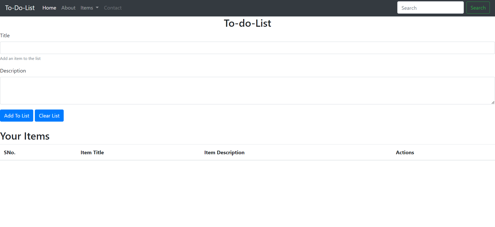

## JS To-Do List

The JS To-Do List is a simple web application that allows you to manage your tasks and stay organized. With a user-friendly interface, you can easily add, edit, and mark tasks as completed. Keep track of your daily tasks, prioritize them, and enjoy a more productive day!

## Features

- **Add Tasks**: Easily add new tasks to your to-do list.
- **Edit Tasks**: Modify task details or update their descriptions.
- **Delete Tasks**: Remove tasks that you no longer need.
- **Local Storage**: Your to-do list is saved in local storage, so your tasks persist across sessions.

## How to Use

1. Open the `index.html` file in your web browser.
2. Type in your task in the input field and press `Enter` or click the "Add" button to add it to the list.
3. Click on a task to mark it as completed. Click again to undo.
4. To edit a task, double-click on it and make the necessary changes.
5. To delete a task, click the "Delete" button next to the task.

## Demo

Check out the live demo of the JS To-Do List [here](https://pandeydhruv2001.github.io/JS-To-do-List/).

## Installation

To run the JS To-Do List locally, follow these steps:

1. Clone the repository: `git clone https://github.com/yourusername/js-to-do-list.git`
2. Navigate to the project directory: `cd js-to-do-list`
3. Open the `index.html` file in your preferred web browser.

## Technologies Used

- HTML5
- CSS3
- JavaScript
- Local Storage API

## Credits

- The design and functionality of the To-Do List are inspired by various online tutorials and resources.

## License

This project is licensed under the [MIT License](LICENSE).

## Contact

For any inquiries or suggestions, please contact [dp0689@srmist.edu.in](mailto:dp0689@srmist.edu.in).

Contributions are welcome! If you'd like to improve the project, feel free to submit pull requests or create issues.

Stay organized and boost your productivity with the JS To-Do List!
